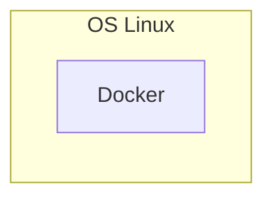
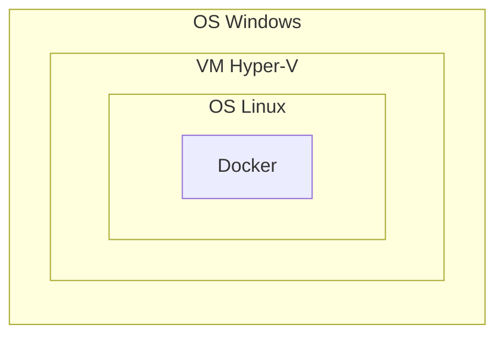
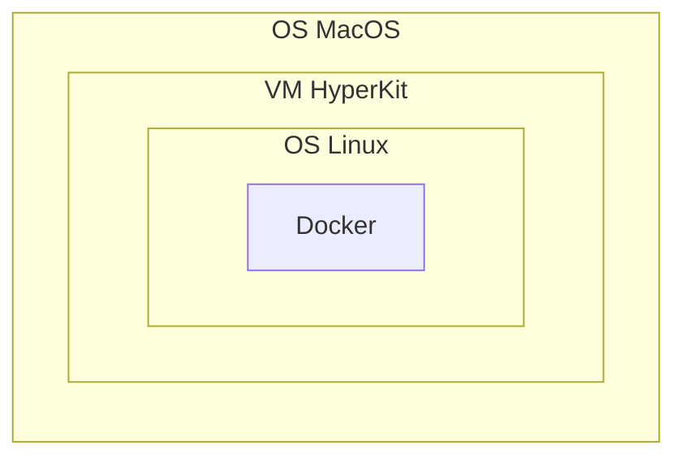
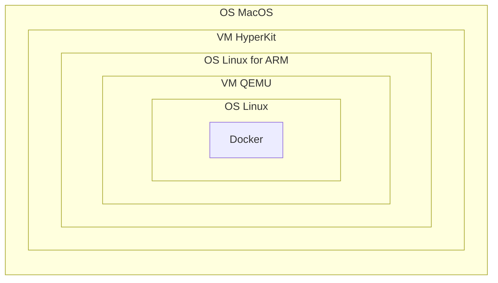

---
tags:
  - docker
  - macos
  - linux
  - vm
  - windows
---
## Linux

No virtual machines, `pivot_root` is used for creating an isolated environment.
## Windows

Windows Linux Subsystem is also Hyper-V.
## MacOS
### x86-based

### ARM-based 

> [!NOTE]
> Solutions for macOS, that make process less complex
> - [OrbStack](https://orbstack.dev/)
>- [Podman](https://podman.io/)
>- [colima](https://github.com/abiosoft/colima)

